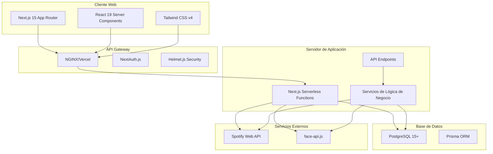
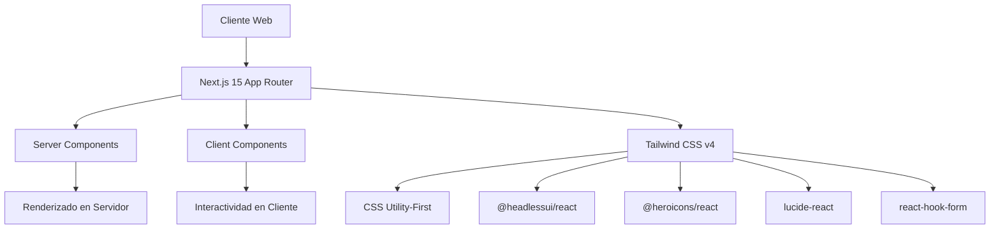
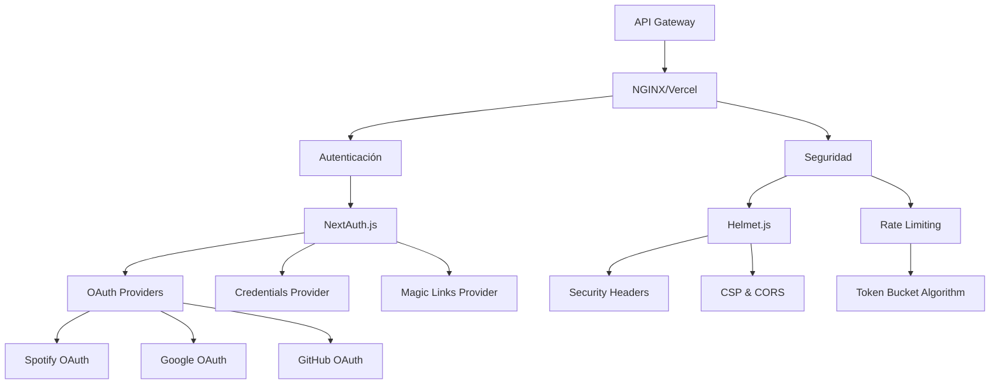
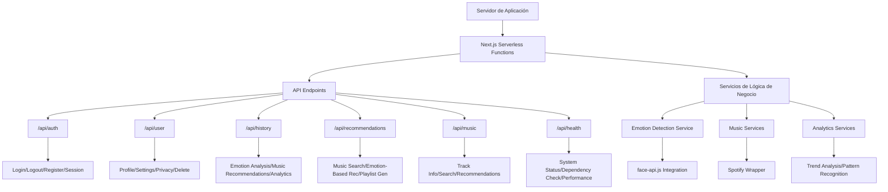
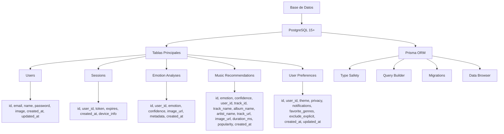
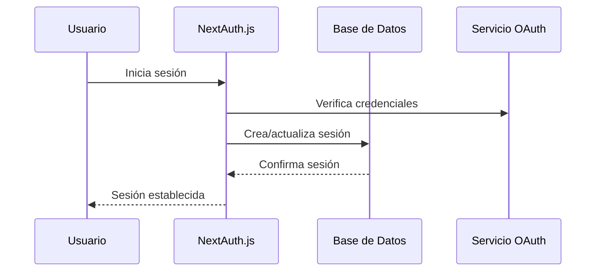
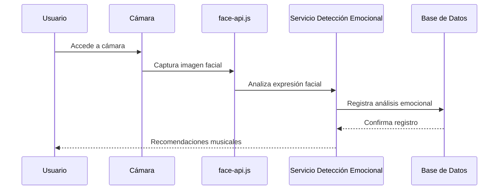
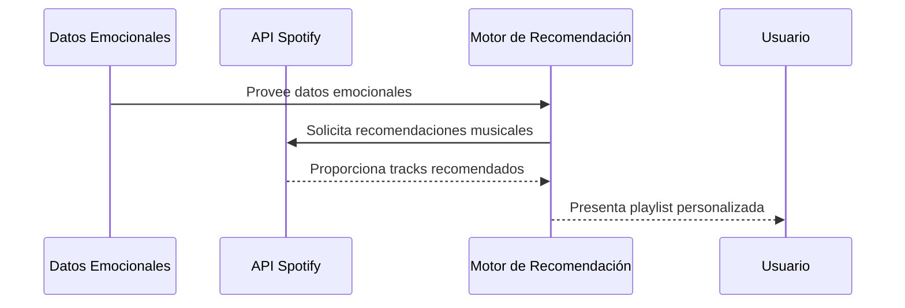

import { Callout } from '@/components/callout';
import { Card, Cards } from '@/components/card';
import { Tabs, Tab } from '@/components/tabs';
import { Banner } from '@/components/banner';
import { ImageZoom } from '@/components/image-zoom';
import { Steps } from '@/components/steps';
import { Files, File, Folder } from '@/components/files';

<Banner type="info">
  
Arquitectura actualizada: La versión 2.0 de Moodify incluye mejoras en la seguridad y escalabilidad.

</Banner>

# Diagrama y Explicación de la Arquitectura

Esta sección presenta la arquitectura de Moodify a través de múltiples diagramas que ilustran diferentes aspectos del sistema, junto con explicaciones detalladas de cada componente y sus interacciones.

## Estructura del Proyecto

<Files >
  <Folder name="moodify/" defaultOpen>
    <Folder name="app/">
      <Folder name="api/">
      </Folder>
      <Folder name="auth/">
        <File name="login/page.tsx" />
        <File name="register/page.tsx" />
      </Folder>
      <Folder name="dashboard/">
        <File name="page.tsx" />
      </Folder>
      <Folder name="detect/">
        <File name="page.tsx" />
      </Folder>
      <Folder name="history/">
        <File name="page.tsx" />
      </Folder>
      <Folder name="recommendations/">
        <File name="page.tsx" />
      </Folder>
      <File name="layout.tsx" />
      <File name="page.tsx" />
    </Folder>
    <Folder name="components/">
      <Folder name="ui/">
        <File name="button.tsx" />
        <File name="card.tsx" />
        <File name="input.tsx" />
      </Folder>
      <Folder name="camera/">
        <File name="camera.tsx" />
        <File name="capture.tsx" />
      </Folder>
      <Folder name="emotion/">
        <File name="detector.tsx" />
        <File name="results.tsx" />
      </Folder>
      <File name="navbar.tsx" />
      <File name="sidebar.tsx" />
    </Folder>
    <Folder name="lib/">
      <File name="auth.ts" />
      <File name="database.ts" />
      <File name="spotify.ts" />
      <File name="face-api.ts" />
    </Folder>
    <Folder name="public/">
      <Folder name="images/" />
      <Folder name="icons/" />
    </Folder>
    <File name="package.json" />
    <File name="next.config.js" />
    <File name="tsconfig.json" />
    <File name="README.md" />
  </Folder>
</Files>

## Arquitectura General

El siguiente diagrama muestra la estructura general de la aplicación Moodify, desde el cliente web hasta los servicios externos:

<Callout type="info" title="Arquitectura Modular">
Esta arquitectura modular y bien definida permite a Moodify crecer y evolucionar manteniendo altos estándares de calidad, seguridad y experiencia de usuario.
</Callout>

## Capas de la Arquitectura

<Tabs items={["Cliente Web", "API Gateway", "Servidor de Aplicación", "Base de Datos", "Servicios Externos"]}>
<Tab value="Cliente Web">

### Capa de Cliente Web

#### Arquitectura del Frontend

#### Next.js 15 con App Router
- **Server Components**: Renderizado parcial en servidor para mejor performance
- **Client Components**: Interactividad en el cliente cuando es necesario
- **Turbopack**: Bundler de próxima generación para compilación ultra rápida
- **React 19**: Última versión de React con mejoras de rendimiento y nuevas APIs

#### Tailwind CSS v4
- **Utility-First CSS**: Clases utilitarias descriptivas y auto-documentadas
- **CSS Nativo**: Sin PostCSS para compilación más rápida
- **Anidamiento CSS**: Soporte nativo para anidamiento de estilos
- **Purging Automático**: Eliminación automática de estilos no utilizados

#### Componentes de Interfaz
- **@headlessui/react**: Componentes accesibles sin estilos predeterminados
- **@heroicons/react**: Íconos optimizados en SVG
- **lucide-react**: Colección completa de íconos consistentes
- **react-hook-form**: Gestión eficiente de formularios con validación Zod

</Tab>
<Tab value="API Gateway">

### Capa de API Gateway

#### Autenticación y Seguridad

#### Autenticación con NextAuth.js
- **OAuth Providers**: Integración con Spotify para autenticación social
- **Credentials Provider**: Autenticación tradicional email/contraseña
- **Magic Links**: Inicio de sesión sin contraseña mediante enlaces
- **JWT**: Tokens firmados y encriptados para sesiones seguras

#### Seguridad y Rate Limiting
- **Helmet.js**: Headers de seguridad HTTP para protección contra ataques comunes
- **Rate Limiting**: Token bucket algorithm para prevenir abusos
- **CORS Configuration**: Configuración flexible de Cross-Origin Resource Sharing
- **CSRF Protection**: Protección automática contra falsificación de solicitudes

</Tab>
<Tab value="Servidor de Aplicación">

### Capa de Servidor de Aplicación

#### Estructura de Endpoints API

La API sigue una estructura RESTful organizada por dominios funcionales:

1. **Authentication** (`/api/auth`): Manejo de inicio de sesión, registro y sesiones
2. **User Management** (`/api/user`): Perfil de usuario y preferencias
3. **History Tracking** (`/api/history`): Registro de análisis emocionales
4. **Music Recommendations** (`/api/recommendations`): Generación de recomendaciones
5. **Music Integration** (`/api/music`): Búsqueda y detalles musicales
6. **Health Check** (`/api/health`): Monitoreo del estado del sistema

#### Servicios de Negocio
Los servicios de negocio encapsulan la lógica específica de dominio:

1. **Emotion Detection Service**: Integración con face-api.js para análisis facial
2. **Music Services**: Wrappers tipados para la API de Spotify
3. **Analytics Services**: Generación de estadísticas y tendencias

</Tab>
<Tab value="Base de Datos">

### Capa de Base de Datos

#### Modelo Relacional

#### Prisma ORM
Prisma proporciona:
- **Type Safety**: Generación automática de tipos TypeScript
- **Query Builder**: API intuitiva para consultas complejas
- **Migrations**: Sistema de migraciones declarativo y versionado
- **Data Browser**: GUI para exploración de datos en desarrollo

#### Modelo Relacional
La base de datos PostgreSQL almacena información estructurada en tablas relacionadas:

1. **Users Table**: Información básica de usuarios
2. **Sessions Table**: Gestión de sesiones activas
3. **Emotion Analyses**: Registros históricos de análisis emocionales
4. **Music Recommendations**: Recomendaciones musicales generadas
5. **User Preferences**: Preferencias personalizadas del usuario

</Tab>
<Tab value="Servicios Externos">

### Servicios Externos

#### Integraciones Externas

```mermaid
graph TD
    A["Servicios Externos"] --> B["Spotify Web API"]
    A --> C["face-api.js"]
    
    B --> D["Metadata Access"]
    B --> E["Search Capabilities"]
    B --> F["Recommendation Engine"]
    B --> G["User Integration"]
    
    D --> H["Track Information"]
    D --> I["Album Information"]
    D --> J["Artist Information"]
    
    E --> K["Filters"]
    E --> L["Sorting"]
    E --> M["Pagination"]
    
    F --> N["Personalization"]
    F --> O["Algorithms"]
    F --> P["Collaborative Filtering"]
    
    G --> Q["Playlists"]
    G --> R["Library"]
    G --> S["Listening History"]
    
    C --> T["Face Detection"]
    C --> U["Expression Analysis"]
    C --> V["Model Loading"]
    
    T --> W["Recognition Models"]
    T --> X["Landmark Detection"]
    
    U --> Y["Happy"]
    U --> Z["Sad"]
    U --> AA["Angry"]
    U --> AB["Surprise"]
    
    V --> AC["TinyFaceDetector"]
    V --> AD["FaceLandmark68Net"]
    V --> AE["FaceRecognitionNet"]
    V --> AF["FaceExpressionNet"]
```

#### Spotify Web API
Integración completa con la plataforma musical líder:

1. **Metadata Access**: Información detallada de tracks, álbumes y artistas
2. **Search Capabilities**: Potente motor de búsqueda con filtros avanzados
3. **Recommendation Engine**: Algoritmos de recomendación basados en audio features
4. **User Integration**: Acceso a playlists, bibliotecas y historial de escucha

#### face-api.js
Sistema avanzado de reconocimiento facial:

1. **Model Loading**: Carga eficiente de modelos de machine learning
2. **Expression Analysis**: Detección precisa de 7 tipos de emociones
3. **Face Recognition**: Identificación y verificación de rostros
4. **Landmark Detection**: Puntos de referencia faciales para análisis detallado

</Tab>
</Tabs>

## Flujos de Datos Principales

<Steps>
  <ol>
    <li>El usuario interactúa con la aplicación web</li>
    <li>La solicitud pasa por el gateway de API</li>
    <li>Se realizan validaciones de seguridad y autenticación</li>
    <li>La lógica de negocio procesa la solicitud</li>
    <li>La base de datos es consultada o actualizada según sea necesario</li>
    <li>Los servicios externos son invocados cuando es necesario</li>
    <li>La respuesta se devuelve al cliente</li>
  </ol>
</Steps>

<Tabs items={["Autenticación", "Detección Emocional", "Recomendaciones Musicales"]}>

<Tab value="Autenticación">

### Flujo de Autenticación

</Tab>
<Tab value="Detección Emocional">

### Flujo de Detección Emocional

</Tab>
<Tab value="Recomendaciones Musicales">

### Flujo de Recomendaciones Musicales

</Tab>
</Tabs>

## Consideraciones de Seguridad

<Callout type="warning" title="Importante">
Implementar medidas de seguridad es fundamental para proteger los datos de los usuarios y mantener la integridad del sistema.
</Callout>

<Cards>
<Card title="Protección contra Fuerza Bruta">
- Bloqueo temporal después de 5 intentos fallidos consecutivos
- Incremento exponencial del tiempo de bloqueo
- Notificación automática de actividad sospechosa
</Card>
<Card title="Prevención de Enumeración de Usuarios">
- Mensajes de error genéricos para evitar revelación de cuentas
- Tiempos de respuesta consistentes independientemente del resultado
- Rate limiting basado en IP y combinaciones email/IP
</Card>
<Card title="Seguridad de Transporte">
- Requisito de HTTPS para todos los endpoints
- Headers de seguridad HTTP Strict Transport Security (HSTS)
- Política de seguridad de contenido (CSP) para prevenir XSS
</Card>
</Cards>

Esta arquitectura modular y bien definida permite a Moodify crecer y evolucionar manteniendo altos estándares de calidad, seguridad y experiencia de usuario, basándose en las tecnologías reales especificadas en el package.json del proyecto.